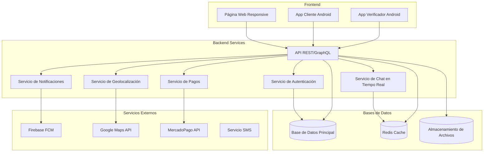
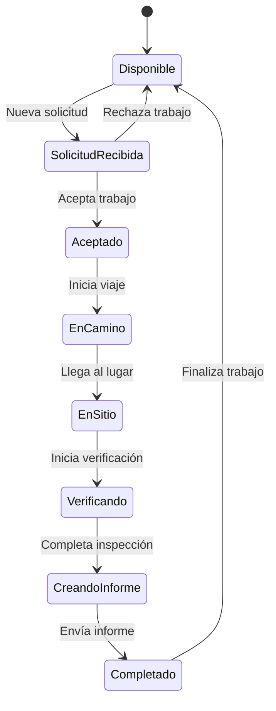
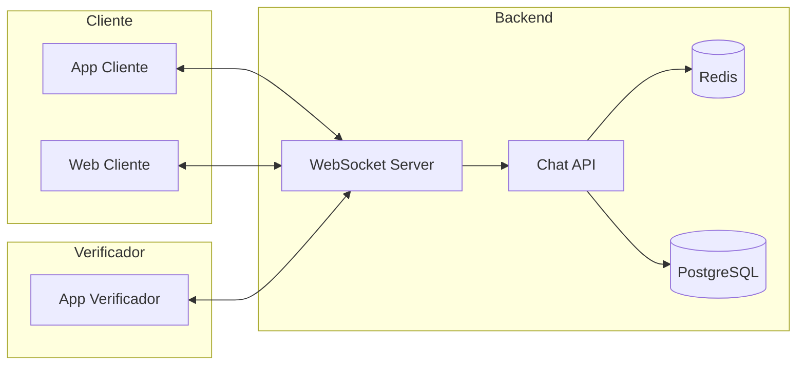
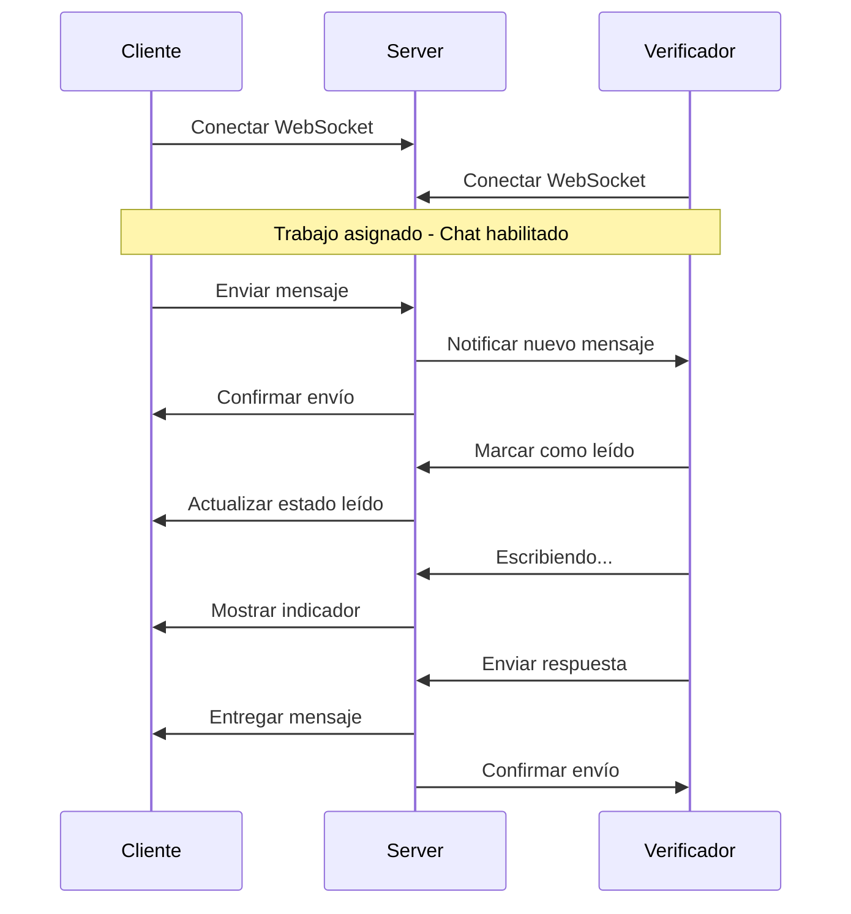

# Documento de Diseño - App y Web Verificadores

## Visión General

El sistema de Verificadores Presenciales sigue un modelo de marketplace bidireccional similar a Uber, conectando usuarios que necesitan verificaciones con profesionales que ofrecen estos servicios. La arquitectura incluye una página web responsive, dos aplicaciones móviles Android nativas, y un backend robusto que maneja la lógica de negocio y comunicación en tiempo real.

## Arquitectura

### Arquitectura General del Sistema



### Stack Tecnológico

#### Frontend Web
- **Framework**: React.js con TypeScript
- **Styling**: Tailwind CSS (consistente con diseños existentes)
- **Estado**: Redux Toolkit + RTK Query
- **Mapas**: Leaflet.js con OpenStreetMap
- **Build**: Vite
- **PWA**: Service Workers para funcionalidad offline

#### Apps Android
- **Lenguaje**: Kotlin
- **UI Framework**: Jetpack Compose
- **Arquitectura**: MVVM + Clean Architecture
- **Navegación**: Navigation Compose
- **Base de datos local**: Room
- **Networking**: Retrofit + OkHttp
- **Imágenes**: Coil
- **Mapas**: Google Maps SDK
- **Cámara**: CameraX

#### Backend
- **Framework**: Node.js con Express.js
- **Lenguaje**: TypeScript
- **Base de datos**: PostgreSQL
- **Cache**: Redis
- **ORM**: Prisma
- **Autenticación**: JWT + Firebase Auth
- **WebSockets**: Socket.io
- **Archivos**: AWS S3 o Google Cloud Storage
- **Containerización**: Docker

## Componentes y Interfaces

### 1. Página Web Responsive

#### Estructura de Páginas
- **Landing Page** (`/`): Página principal con hero, beneficios, testimonios
- **Búsqueda de Verificadores** (`/verificadores`): Lista filtrable de verificadores
- **Perfil de Verificador** (`/verificador/:id`): Perfil detallado con opiniones
- **Solicitar Verificación** (`/solicitar`): Formulario de solicitud
- **Mapa en Vivo** (`/mapa`): Visualización en tiempo real
- **Informe de Verificación** (`/informe/:id`): Reporte detallado
- **Dashboard Usuario** (`/dashboard`): Panel de control personal
- **Autenticación** (`/login`, `/register`): Páginas de acceso

#### Componentes Principales
```typescript
// Componentes compartidos
interface HeaderComponent {
  navigation: NavigationItem[]
  user?: User
  onLogin: () => void
  onLogout: () => void
}

interface VerificadorCard {
  verificador: Verificador
  onSelect: (id: string) => void
  showDistance?: boolean
}

interface MapComponent {
  jobs: Job[]
  verificadores: Verificador[]
  filters: MapFilters
  onJobSelect: (job: Job) => void
}

interface ChatComponent {
  conversationId: string
  currentUser: User
  otherUser: User
  messages: Message[]
  isTyping: boolean
  onSendMessage: (message: string) => void
  onSendImage: (image: File) => void
  onSendLocation: (coordinates: Coordinates) => void
  onMarkAsRead: (messageId: string) => void
}
```

### 2. App Cliente Android (VerificadoresCliente)

#### Pantallas Principales
- **Onboarding**: Introducción y registro
- **Home**: Dashboard con acciones rápidas
- **Solicitar**: Formulario de nueva solicitud
- **Verificadores**: Lista y búsqueda de verificadores
- **Mapa**: Vista de mapa con verificadores activos
- **Chat**: Comunicación con verificador asignado
- **Historial**: Verificaciones pasadas
- **Perfil**: Configuración de cuenta

#### Navegación
```kotlin
sealed class ClienteScreen(val route: String) {
    object Home : ClienteScreen("home")
    object Solicitar : ClienteScreen("solicitar")
    object Verificadores : ClienteScreen("verificadores")
    object VerificadorDetail : ClienteScreen("verificador/{id}")
    object Mapa : ClienteScreen("mapa")
    object Chat : ClienteScreen("chat/{conversationId}")
    object Historial : ClienteScreen("historial")
    object Perfil : ClienteScreen("perfil")
}
```

### 3. App Verificador Android (VerificadoresPro)

#### Pantallas Principales
- **Dashboard**: Estadísticas e ingresos
- **Trabajos Disponibles**: Lista de solicitudes pendientes
- **Trabajo Activo**: Detalles del trabajo actual
- **Navegación**: GPS hacia ubicación del producto
- **Verificación**: Herramientas para crear informe
- **Chat**: Comunicación con cliente
- **Perfil Profesional**: Gestión de especialidades y tarifas
- **Historial**: Trabajos completados

#### Flujo de Trabajo del Verificador


## Sistema de Chat en Tiempo Real

### Arquitectura del Chat

El sistema de chat permite comunicación bidireccional entre clientes y verificadores durante todo el proceso de verificación.



### Funcionalidades del Chat

#### Para Clientes
- Comunicación directa con verificador asignado
- Envío de mensajes de texto, imágenes y ubicación
- Notificaciones push cuando el verificador responde
- Historial de conversaciones por verificación
- Indicadores de mensaje leído/no leído
- Estado "escribiendo..." en tiempo real

#### Para Verificadores
- Chat con cliente durante trabajo activo
- Compartir ubicación en tiempo real cuando está en camino
- Envío de fotos del producto durante verificación
- Notificaciones de nuevos mensajes
- Acceso rápido al chat desde pantalla de trabajo

### Componentes del Chat

```typescript
interface Message {
  id: string
  conversationId: string
  senderId: string
  type: MessageType
  content: string
  metadata?: MessageMetadata
  timestamp: Date
  isRead: boolean
}

interface MessageMetadata {
  imageUrl?: string
  coordinates?: Coordinates
  fileName?: string
  fileSize?: number
}

interface ChatState {
  conversations: Conversation[]
  activeConversation?: string
  messages: Record<string, Message[]>
  typingUsers: Record<string, string[]>
  unreadCounts: Record<string, number>
}
```

### Flujo de Comunicación



## Modelos de Datos

### Entidades Principales

```typescript
interface User {
  id: string
  email: string
  phone: string
  name: string
  avatar?: string
  role: 'cliente' | 'verificador' | 'admin'
  isVerified: boolean
  createdAt: Date
  updatedAt: Date
}

interface Verificador extends User {
  specialties: Specialty[]
  coverageZones: Zone[]
  rating: number
  totalJobs: number
  priceRanges: PriceRange[]
  availability: Availability
  documents: Document[]
  isActive: boolean
}

interface Job {
  id: string
  clienteId: string
  verificadorId?: string
  category: Category
  productDescription: string
  address: Address
  coordinates: Coordinates
  scheduledDate: Date
  budget: number
  status: JobStatus
  notes?: string
  createdAt: Date
}

interface VerificationReport {
  id: string
  jobId: string
  verificadorId: string
  generalCondition: number // 1-10
  recommendation: 'buy' | 'negotiate' | 'avoid'
  photos: Photo[]
  details: ReportDetail[]
  comments: string
  createdAt: Date
}

interface Conversation {
  id: string
  jobId: string
  participants: string[]
  messages: Message[]
  isActive: boolean
  createdAt: Date
}
```

### Estados del Sistema

```typescript
enum JobStatus {
  PENDING = 'pending',
  ASSIGNED = 'assigned',
  IN_PROGRESS = 'in_progress',
  COMPLETED = 'completed',
  CANCELLED = 'cancelled'
}

enum MessageType {
  TEXT = 'text',
  IMAGE = 'image',
  LOCATION = 'location',
  SYSTEM = 'system'
}
```

## Manejo de Errores

### Estrategia de Errores
- **Errores de Red**: Retry automático con backoff exponencial
- **Errores de Validación**: Mensajes específicos en UI
- **Errores del Servidor**: Logging centralizado y notificación a admins
- **Errores de Geolocalización**: Fallback a dirección manual

### Códigos de Error Estándar
```typescript
enum ErrorCode {
  VALIDATION_ERROR = 'VALIDATION_ERROR',
  UNAUTHORIZED = 'UNAUTHORIZED',
  FORBIDDEN = 'FORBIDDEN',
  NOT_FOUND = 'NOT_FOUND',
  CONFLICT = 'CONFLICT',
  RATE_LIMITED = 'RATE_LIMITED',
  SERVER_ERROR = 'SERVER_ERROR'
}
```

## Estrategia de Testing

### Testing Web
- **Unit Tests**: Jest + React Testing Library
- **Integration Tests**: Cypress
- **E2E Tests**: Playwright
- **Performance**: Lighthouse CI

### Testing Android
- **Unit Tests**: JUnit + Mockk
- **UI Tests**: Espresso + Compose Testing
- **Integration Tests**: Hilt Testing
- **Performance**: Android Profiler

### Testing Backend
- **Unit Tests**: Jest
- **Integration Tests**: Supertest
- **Load Tests**: Artillery
- **Database Tests**: Test containers

## Consideraciones de Seguridad

### Autenticación y Autorización
- JWT tokens con refresh token rotation
- Rate limiting por IP y usuario
- Validación de roles en cada endpoint
- Encriptación de datos sensibles

### Protección de Datos
- HTTPS obligatorio en todas las comunicaciones
- Validación y sanitización de inputs
- Logs de auditoría para acciones críticas
- Backup automático de base de datos

### Verificación de Identidad
- Verificación de documentos para verificadores
- Validación de teléfono por SMS
- Sistema de reportes y moderación
- Blacklist de usuarios problemáticos

## Optimización de Performance

### Frontend
- Code splitting por rutas
- Lazy loading de imágenes
- Service Workers para cache
- Compresión de assets

### Backend
- Cache de consultas frecuentes en Redis
- Paginación en todas las listas
- Optimización de queries SQL
- CDN para archivos estáticos

### Mobile
- Offline-first architecture
- Image caching y compresión
- Background sync para datos críticos
- Optimización de batería

## Monitoreo y Analytics

### Métricas de Negocio
- Número de verificaciones completadas
- Tiempo promedio de respuesta
- Rating promedio de verificadores
- Tasa de conversión de solicitudes

### Métricas Técnicas
- Tiempo de respuesta de API
- Errores por endpoint
- Uso de memoria y CPU
- Disponibilidad del sistema

### Herramientas
- **Logging**: Winston + ELK Stack
- **Monitoring**: Prometheus + Grafana
- **Error Tracking**: Sentry
- **Analytics**: Google Analytics + Custom events