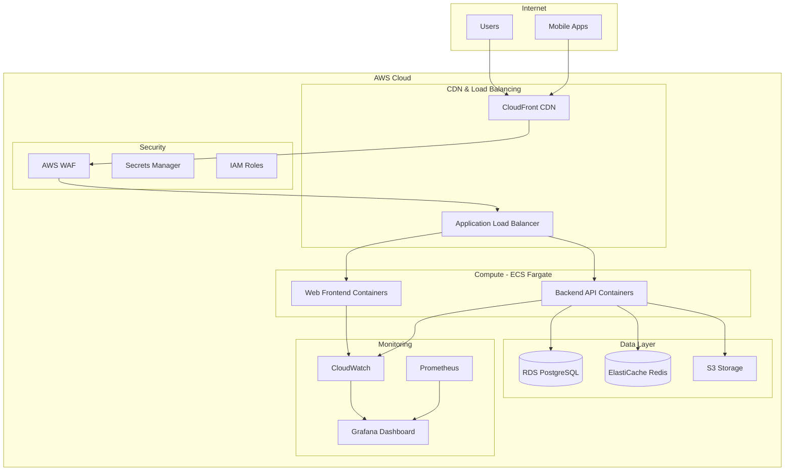
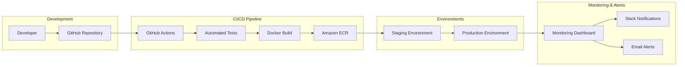

# Production Deployment Design

## Overview

This design outlines the complete production deployment strategy for the Verificadores platform, including cloud infrastructure, CI/CD automation, monitoring, and security configurations. The deployment will use AWS services with Docker containers, automated pipelines, and comprehensive monitoring to ensure a reliable, scalable, and secure production environment.

## Architecture

### Cloud Infrastructure Architecture



### Deployment Pipeline Architecture



## Components and Interfaces

### 1. Cloud Infrastructure Components

#### AWS ECS Fargate Cluster
- **Purpose**: Container orchestration for backend and frontend services
- **Configuration**: Auto-scaling, health checks, service discovery
- **Resources**: 
  - Backend: 3 tasks, 1 vCPU, 2GB RAM each
  - Frontend: 2 tasks, 0.5 vCPU, 1GB RAM each

#### Application Load Balancer (ALB)
- **Purpose**: Traffic distribution and SSL termination
- **Features**: Health checks, sticky sessions, path-based routing
- **SSL**: AWS Certificate Manager for HTTPS

#### Amazon RDS PostgreSQL
- **Purpose**: Primary database with automated backups
- **Configuration**: Multi-AZ deployment, automated backups, encryption
- **Instance**: db.t3.medium with 100GB storage

#### ElastiCache Redis
- **Purpose**: Session storage and application caching
- **Configuration**: Cluster mode, automatic failover
- **Instance**: cache.t3.micro with 1GB memory

#### Amazon S3 + CloudFront
- **Purpose**: Static asset storage and global CDN
- **Features**: Image optimization, gzip compression, edge caching
- **Buckets**: Static assets, user uploads, backups

### 2. CI/CD Pipeline Components

#### GitHub Actions Workflows
- **Backend CI/CD**: Testing, building, and deployment
- **Frontend CI/CD**: Building, optimization, and S3 deployment
- **Android CI/CD**: APK building and Play Store deployment

#### Container Registry (ECR)
- **Purpose**: Docker image storage and versioning
- **Features**: Image scanning, lifecycle policies
- **Repositories**: backend-prod, backend-staging, web-prod, web-staging

#### Deployment Automation
- **Blue-Green Deployment**: Zero-downtime deployments
- **Health Checks**: Automated rollback on failure
- **Database Migrations**: Automated with rollback capability

### 3. Monitoring and Logging

#### CloudWatch Integration
- **Metrics**: Application performance, infrastructure health
- **Logs**: Centralized logging from all services
- **Alarms**: Automated alerts for critical issues

#### Prometheus + Grafana Stack
- **Custom Metrics**: Business metrics, API performance
- **Dashboards**: Real-time monitoring and historical data
- **Alerting**: Integration with Slack and email

#### ELK Stack (Optional)
- **Log Analysis**: Advanced log searching and analysis
- **Kibana Dashboards**: Log visualization and patterns
- **Alerting**: Custom log-based alerts

## Data Models

### Environment Configuration

```typescript
interface DeploymentEnvironment {
  name: 'staging' | 'production';
  domain: string;
  apiUrl: string;
  databaseUrl: string;
  redisUrl: string;
  s3Bucket: string;
  cdnDomain: string;
  monitoring: {
    grafanaUrl: string;
    prometheusUrl: string;
    kibanaUrl: string;
  };
  scaling: {
    minInstances: number;
    maxInstances: number;
    targetCpuUtilization: number;
  };
}
```

### Infrastructure as Code

```yaml
# terraform/main.tf structure
resource "aws_ecs_cluster" "verificadores" {
  name = "verificadores-${var.environment}"
  
  setting {
    name  = "containerInsights"
    value = "enabled"
  }
}

resource "aws_ecs_service" "backend" {
  name            = "backend-service"
  cluster         = aws_ecs_cluster.verificadores.id
  task_definition = aws_ecs_task_definition.backend.arn
  desired_count   = var.backend_instance_count
  
  load_balancer {
    target_group_arn = aws_lb_target_group.backend.arn
    container_name   = "backend"
    container_port   = 3000
  }
  
  deployment_configuration {
    maximum_percent         = 200
    minimum_healthy_percent = 100
  }
}
```

## Error Handling

### Deployment Failure Recovery

1. **Automated Rollback**
   - Health check failures trigger automatic rollback
   - Database migration failures prevent deployment
   - Container startup failures revert to previous version

2. **Manual Recovery Procedures**
   - Emergency rollback commands
   - Database backup restoration
   - Service restart procedures

3. **Monitoring and Alerting**
   - Real-time deployment status monitoring
   - Slack/email notifications for failures
   - Automated incident creation in monitoring systems

### Application Error Handling

1. **Circuit Breaker Pattern**
   - Prevent cascade failures between services
   - Automatic recovery when services are healthy
   - Fallback responses for degraded functionality

2. **Graceful Degradation**
   - Core functionality remains available during partial outages
   - Non-critical features disabled during high load
   - User-friendly error messages

## Testing Strategy

### Pre-Deployment Testing

1. **Automated Test Suite**
   - Unit tests (90%+ coverage)
   - Integration tests for API endpoints
   - End-to-end tests for critical user flows
   - Performance tests for load validation

2. **Security Testing**
   - Dependency vulnerability scanning
   - Container image security scanning
   - Infrastructure security validation
   - Penetration testing (quarterly)

### Post-Deployment Validation

1. **Smoke Tests**
   - Critical functionality verification
   - API endpoint health checks
   - Database connectivity validation
   - External service integration tests

2. **Performance Monitoring**
   - Response time monitoring
   - Throughput measurement
   - Error rate tracking
   - Resource utilization monitoring

### Staging Environment Testing

1. **Production-like Environment**
   - Same infrastructure configuration as production
   - Realistic data volumes for testing
   - Full monitoring and logging setup

2. **User Acceptance Testing**
   - Stakeholder validation before production deployment
   - Mobile app testing on staging environment
   - Performance validation under load

## Security Considerations

### Infrastructure Security

1. **Network Security**
   - VPC with private subnets for databases
   - Security groups with minimal required access
   - WAF rules for common attack patterns
   - DDoS protection via CloudFront

2. **Access Control**
   - IAM roles with least privilege principle
   - Multi-factor authentication for AWS console
   - Service-to-service authentication via IAM roles
   - Secrets management via AWS Secrets Manager

3. **Data Protection**
   - Encryption at rest for databases and S3
   - Encryption in transit via HTTPS/TLS
   - Database connection encryption
   - Secure backup storage

### Application Security

1. **Authentication & Authorization**
   - JWT token validation
   - Role-based access control
   - Session management via Redis
   - API rate limiting

2. **Input Validation**
   - Request validation middleware
   - SQL injection prevention
   - XSS protection headers
   - File upload security

## Deployment Phases

### Phase 1: Infrastructure Setup (Week 1)
- AWS account setup and IAM configuration
- VPC and networking configuration
- RDS and ElastiCache setup
- S3 buckets and CloudFront distribution
- SSL certificates and domain configuration

### Phase 2: CI/CD Pipeline (Week 2)
- GitHub Actions workflow configuration
- ECR repositories setup
- ECS cluster and service definitions
- Terraform infrastructure as code
- Staging environment deployment

### Phase 3: Production Deployment (Week 3)
- Production environment setup
- Database migration and data seeding
- DNS configuration and SSL setup
- Monitoring and alerting configuration
- Load testing and performance validation

### Phase 4: Go-Live and Monitoring (Week 4)
- Production deployment
- User acceptance testing
- Performance monitoring setup
- Documentation and runbook creation
- Team training on operations procedures

## Cost Optimization

### Resource Sizing
- Right-sizing based on expected load
- Auto-scaling policies to handle traffic spikes
- Reserved instances for predictable workloads
- Spot instances for non-critical workloads

### Monitoring and Alerts
- Cost monitoring and budgets
- Resource utilization tracking
- Automated scaling based on metrics
- Regular cost optimization reviews

### Estimated Monthly Costs (USD)
- ECS Fargate: $150-300
- RDS PostgreSQL: $100-200
- ElastiCache Redis: $50-100
- S3 + CloudFront: $20-50
- Load Balancer: $25
- Monitoring: $30-60
- **Total: $375-735/month**